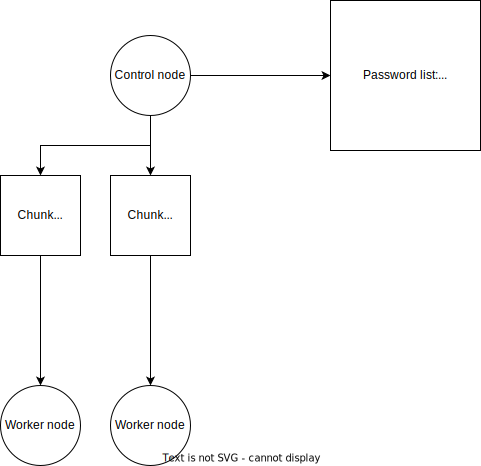

# Destributed Word Doc Password "Recovery"
## Context
One day before VG2 was having a English exam I got this message from a classmate  

  

Now, I could help him cheat on the exam, however that would be no fun.  
What would be fun however, would be showing him the exam banner, and leaving him alone to the exam without cheating.  

## The plan
The plan was to create a distributed word password cracking system, as I assumed that the password would be too difficult to crack with only one PC/thread.  

So to combat this, this would be using a control node, worker nodes architecture.  

### The control node
The control node is the process used to assign a group of passwords (a chunk) to each worker node, and handling issues relating to nodes going down mid chunk.  
For rapid development, this was hosted on my laptop.  

As this needed to be accessed from the worker nodes, which wheren't located in my laptop I needed to make it exposed to the internet.  
The proper way to do this would be to use port forwarding, however that wouldn't be possible to use while developing at school.  
I could have used ssh port forwarding to a host I controlled and port forwarded from that, however I ended up using [bore.pub](https://bore.pub) and setting a manual redirect in fabio to redirect a subdomain to my active bore.pub port.  

## The worker node
The worker node would connect to the control node and try the chunks of password it sends, and report back when it finished or if it found the password.  

## Password chunking
### Sending the raw chunk
  
Now the issue is creating chunks of passwords and distributing it to the workers.  

The first approach was just generating every possible combination of passwords at a given length, and increasing the length once it had distributed all the passwords at the current length.  
This worked fine for a while, however we quickly reached the websocket message size when increasing the chunk size.  

### Giving the generation to the worker
  
Sending the raw passwords over the websocket is really inefficient. Why not give the load to the workers?  

So instead of sending a list of passwords, we sent a `length`, `start` and `end`  

(psuedo-code)  
```py
while True:
    predefined_password_chars = string.ascii_letters + "øØæÆåÅ" + string.digits
    length, start, end = await connection.receive_chunk()
    
    passwords = []
    for password_id, password in enumerate(itertools.product(predefined_password_chars, repeat=length)):
        if password_id < start:
            continue
        if password_id > length:
            break
        passwords.append("".join(password))
```

Constantly going from 0 to start is inefficient, however it only took about 0.001 seconds so it was not worth fixing.  
The other issue was that the character list was fixed, and we eventually wanted to switch to a wordlist.  

### Making the worker load the character/word list
As we wanted the client to be able to switch between a few different word lists, we made the client download the word list when starting up from the server.  
