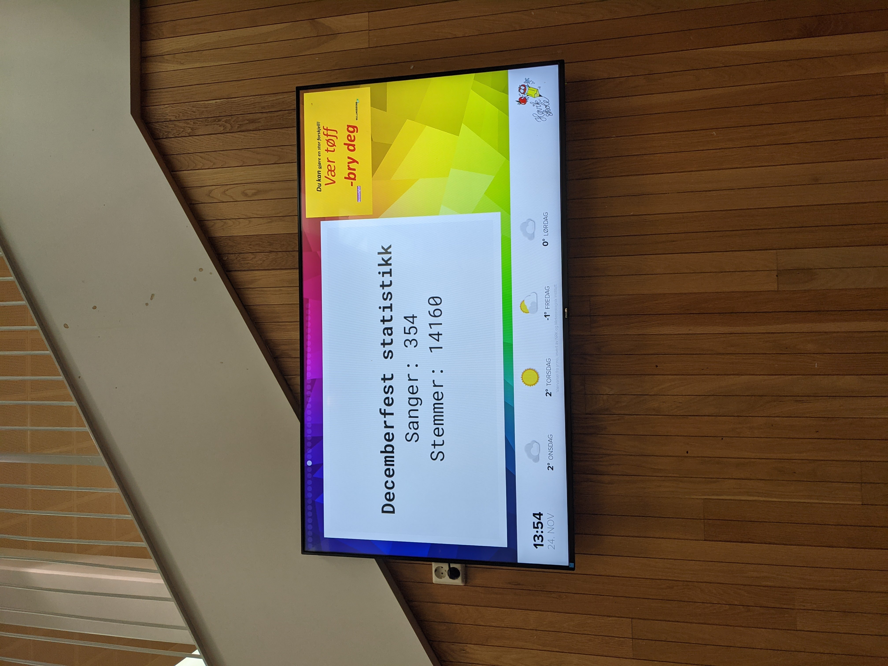
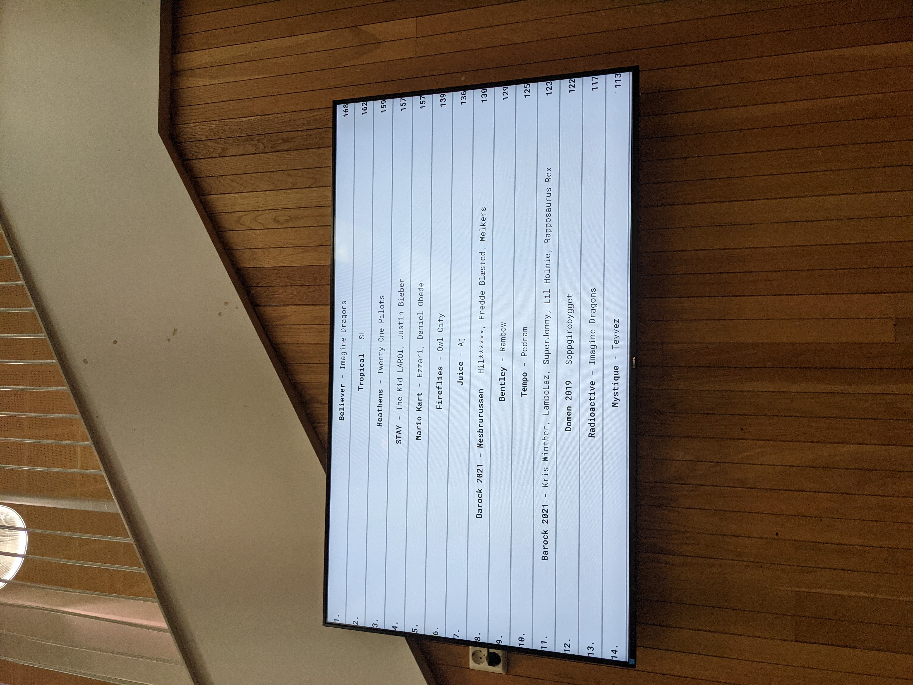
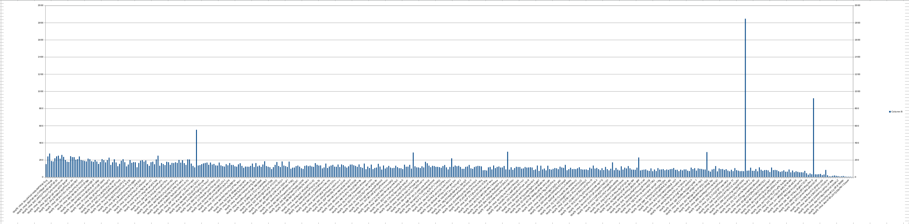
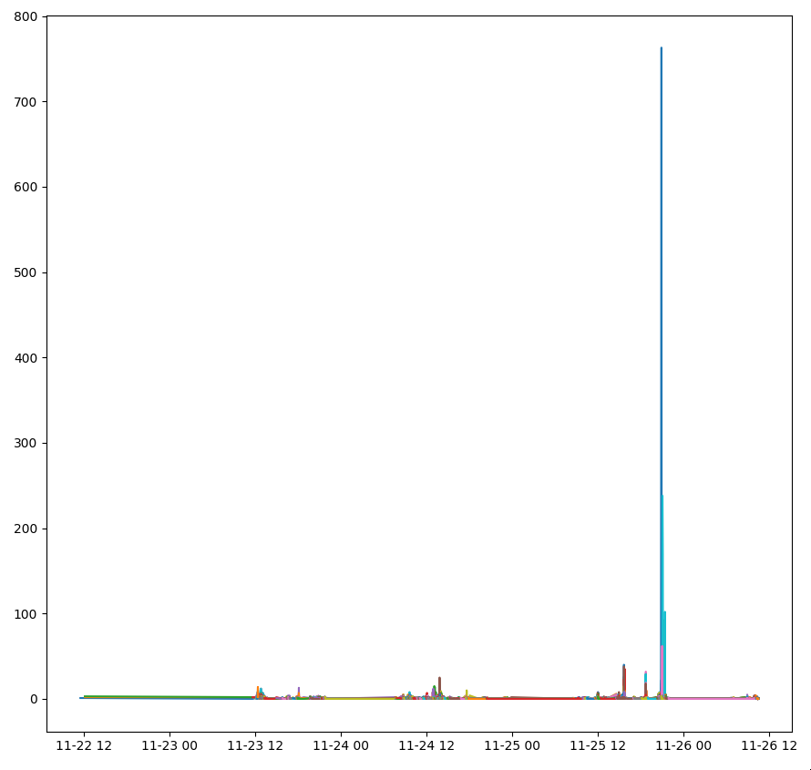
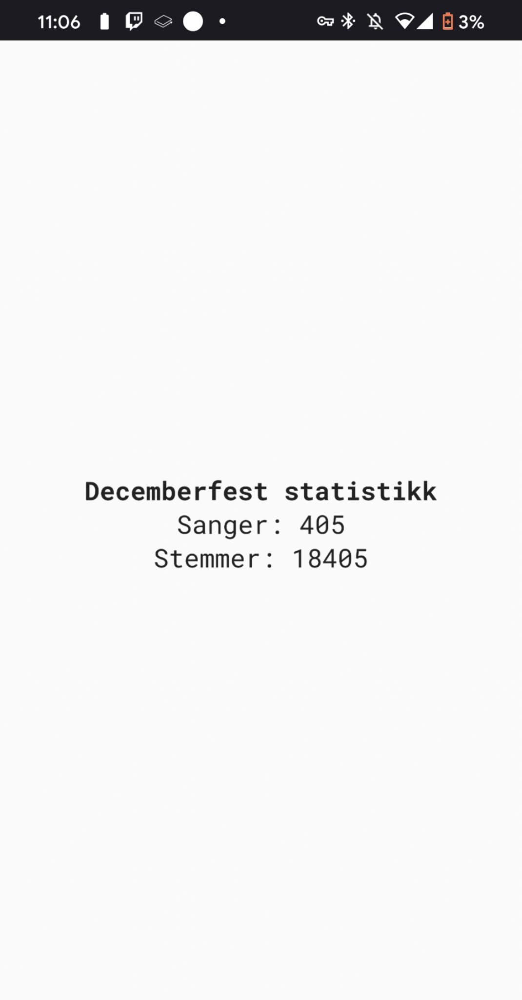

# Song voting system
## Introduction
Every year, the school has a "Decemberfest" where the students are allowed to choose the songs that gets played before it starts.  
The process worked like this:  
1. Every class gets students to say the songs they want played out loud
2. The teacher adds the song to the whiteboard if appropriate
3. The teacher gathers votes for every song, and the 3 most popular songs gets sent to their student council representitive.
4. The student council representivie brings the 3 most popular songs to the student council meeting
5. The student council decides which songs are appropriate, and removes the ones that aren't
6. The student council votes on the songs they want added, and the top 10 songs get submitted to the people playing the music

Now this system *works* however it has tons of issues:
- Which songs are appropriate is very subjective. Some songs have gotten removed because the teacher doesn't like them, which I do not find fair.
- The student council representivies forget to send in their class's songs.
- The system favours smaller classes and classes with less song ideas.
- Some people are shy about their music taste. Forcing them to say it out loud if they want any may lead to fewer amount of songs
- No one is happy because they feel like their class was underrepresented. This leads to people coming up to the sound desk and complaining, which isn't fun.

## Requirements
- The voting needs to be fair
- No human should be able to "veto" out songs
- It needs to be anonymous as I do not want to deal with GDPR issues.
- Cheating should be hard.

## Submitting songs
I wanted a way for people to submit songs thats better than a simple text input. So I used spotify's api for this.

I proxied spotify's search endpoint through the api, and made a song search that resembles google.  
Note that you had to click one of the results, you could not send in arbitrary text. This confused a few people.  

### Moderation
As this is a school, I wanted to avoid the teachers/the student council moderating the songs that was added as they are very biased.
I have used [IBM's MAX](https://github.com/IBM/MAX-Toxic-Comment-Classifier) before and it works well for detecting inappropriate lyrics. The only downside being that it needs text in English.

So when a user submits a song we:
- Find the lyrics from [happi's lyrics api](https://happi.dev) as spotify does not provide lyrics via their api
- Use [google trans](https://pypi.org/project/googletrans) to translate the lyrics to English
- Use [IBM's MAX](https://github.com/IBM/MAX-Toxic-Comment-Classifier) to detect whether the lyrics is appropriate
- Return a error if it goes over certain thresholds

This worked well, and kept most songs out.

### Voting

As I was inspired by [Tom Scott's Best Thing](https://www.youtube.com/watch?v=ALy6e7GbDRQ) video, I wanted the voting system to work in the same way:
Two songs pop up next to eachother, you click on the song you liked the most.

This allows for a large volume of votes in a short time, and making cheating via using incognito or similar harder.

## The execution
The plan was to make people submit songs first, then once everyone had submitted a song people would be given access to vote.  
This would make sure every song had the same chance of exposure to voters.

Unfortunatley this did not happen as it would take too much time away from the students education.

Execution of the voting otherwise went pretty well, however the load was way higher than expected.

https://github.com/Blorptopia/README/assets/118888460/d3612b7a-3b0c-4a82-9587-11154cbd53ae

I also added statistics to the news screen in the school area.

## Issues under execution
### Not self hosting IBM MAX
As I was a bit too lazy, I decided not to self host IBM MAX, and instead use the demo site they provide as just a normal API.

However mid execution while people where submitting songs the demo site went down and caused all the song submissions to fail while I set up a self hosted version.

### The server going down
While fixing things related to IBM MAX and other minor things the API went down.

However thankfully due to me being too lazy to implement error handling, any errors where ignored and just console logged.
This was great in this instance as it let me restart the server without having to worry about the client having issues and people leaving early to do something else.

## Postmortem
### Cheating?
As every vote was saved as a unique object in the database with a timestamp of when it was registered, I decided to do a bit of graphs.

This was weird to me so I did a bit more graphing.

So seems like someone found out how to use the API to artifically get tons of votes on one song.

Thankfully it was very easy to just drop the votes in the specified time range.

### Unbalanced system

When I was making the system I assumed it would be in two waves - first wave being adding songs, and once thats done everyone would vote on it.
Sadly that did not happen, and that caused songs that was submitted first to have a way higher chance of being shown to potential voters.
Some songs that was submitted later was so universally loved that it did not matter though.

### Getting the songs played
Sadly the student council still wanted to look over the songs, and I was not there the day they did it, so they unfortunatley removed songs as they saw fit.
This included removing christmas songs as they where sick of them, and ignoring the votes.

Thankfully though - nobody enjoyed the song selection. If only they would have used the system this wouldnt have been a issue.

### Final stats

We managed to get over 400 songs and over 18,000 votes sent in, and I would guess about 2,000 was lost due to the server being off.
